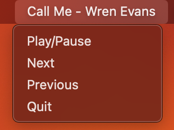

# spotify-widget-macos
Simple Spotify widget on the menubar using rumps library.

## Installation:
###### Make sure you have python installed already!

1. Clone the repository
2. Navigate to the repository directory on your computer
3. Run command `python main.py`